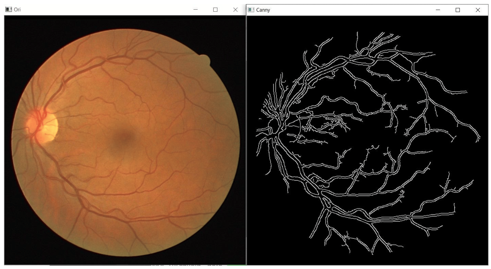
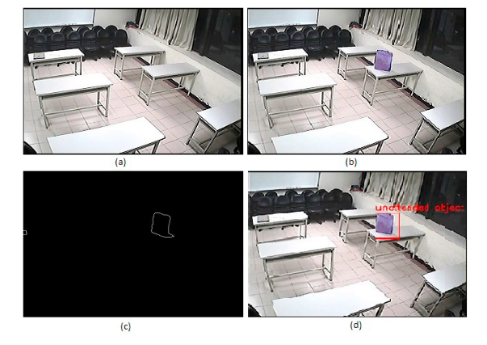
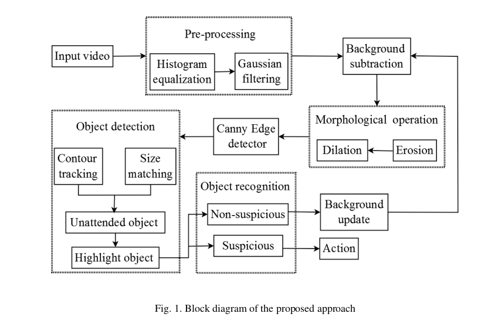

## Uge 2 - Computer Vision - Filtre, detection baseret på form, thresholding, morphological operations
---

## Linksamling:

Bruges til forberedelse og kodebasis til øvelser

* Blur og sharpening filter via convolutions https://learnopencv.com/image-filtering-using-convolution-in-opencv/
* Thresholding https://docs.opencv.org/4.x/d7/d4d/tutorial_py_thresholding.html og https://docs.opencv.org/4.x/db/d8e/tutorial_threshold.html
* Image gradients https://docs.opencv.org/4.x/d5/d0f/tutorial_py_gradients.html
* Canny edge detection https://docs.opencv.org/4.x/da/d5c/tutorial_canny_detector.html
* Contour detection https://learnopencv.com/contour-detection-using-opencv-python-c/

---

## Forberedelse til tirsdagens lektion

Lidt om kernels - de bliver brugt til mange filtre i computer vision, til nogle detektorer (f.eks. edge detection), og de bliver brugt i convolutional neural networks der danner basis for stort set al machine learning i computer vision i dag.

* Læs om kernels og se eksempler på brugen af dem: https://en.wikipedia.org/wiki/Kernel_(image_processing)
* Brug blur-filtre og test forskellige kernel settings. Gem resultat billeder lokalt med `cv.imwrite`
* Læs om image gradients og afprøv Sobel filtre på slørede billeder

---
## Tirsdagens agenda

* Brugen af filtre
* Edge detection på filtrerede billeder
* Corner detection
* Eksempel på pipeline konstruktion
* Morphological operations hvis vi når det

---

## Hvorfor filtre?

* Sløring mindsker støj og kan gøre små objekter uigenkendelige for en edge detector
* Derfor giver sløring mulighed for at finde flest "true positive" kanter, hvor uden vil meget støj forkert blive genkendt som kant
* Med kanter centreret omkring det vigtigt objekt kan vi bedre detektere dem med sikkerhed

---

## Opgave 0 - Gaussian filter forskellige kernel størrelser

* Prøv Gaussian filter på jeres billede med flere forskellige kernel størrelser (start fra 3, 3)
* Hvad sker der med billedet med forskellige kernel størrelser?

---
## Edge detection 

---

## Edge detection noter

- Præcise og/eller generaliserende edge detection kræver oftest filtrering i flere lag
- Edge detection er meget sensitiv overfor støj
- Lettere at gøre på gråtonebilleder
- Ofte udført før vi detektere konturer
- Canny edge detection er typisk den bedste baseline

---

## Edge detection caveats

* Edge detection er generelt ikke gode til at lukke hele omrids
* Hele omrids er nødvendigt for automatisk at kunne tælle objekter, beregne størrelse og skelne dem med sikkerhed
* Hele omrids er bedre fundet med Canny edge detection som minimum

---
## Typisk pipeline til edge og contour detection

- Grayscale konvertering
- Filtre - Gaussian blur f.eks.
- Edge detection
	- Hvis det fejler stadig, prøv thresholding
- Dilation til at gøre kanter tykkere
- Evt. erosion til at forbinde kanter

--- 
## Unattended luggage case

https://www.sciencedirect.com/science/article/pii/S1877050920311972?ref=cra_js_challenge&fr=RR-1

---
## Pipeline til unattended luggage case

---
## Opgave 1

* Afprøv ovenstående pipeline indtil edge detection (det slide med titel Typisk pipeline til edge og contour detection)
* Prøv at justér kernel size på Gaussian filter og anvend Canny edge detection på billedet med forskellige niveauer af sløring
* Afprøv adaptive thresholding (https://docs.opencv.org/4.x/d7/d4d/tutorial_py_thresholding.html) og sammenlign kanter
* Hvad producerer de mest tydelige kanter?

---
## Opgave 2 - Indstillinger på Canny

* Canny er en typisk baseline algoritme til edge detection 
* Den kræver en del manuel indstilling af parametre for at fungere optimalt
* Dette er variablene `lowThreshold` og `kernel_size`
* Eksperimenter med at justere disse for bedre kanter

---
## Opgave 3 - Canny på patches

* Canny kan opfører sig forskelligt i forskellige områder på samme billede pga. lys
* Hvis vi deler billedet op i patches og bruger adaptive thresholding teknikker på hver patch kan vi til en hvis grad gøre op med denne begrænsning
* Derudover kan det at kombinere farvedetektering med threshold + kernel indstillinger hjælpe med kun at få edges fra det ønskede objekt

---
## Ekstra - filtre med egne kernels

Hvis du ønsker at forstå kernels bedre eller bare vil eksperimentere med forskellige kernelkonfigurationer kan du prøve at definere egne kernels:

* https://docs.opencv.org/3.4/d4/dbd/tutorial_filter_2d.html

---
## Onsdag selvstudie

* Afprøv thresholding metoder - Otsu's og trunc https://docs.opencv.org/4.x/d7/d4d/tutorial_py_thresholding.html
* Beregn histogrammer på resulterende billeder og sammenlign de 2 metoder
* Se om du kan dele billedet op i objekter bare baseret på det resulterende billede

---
## Torsdagens agenda

* Workshop og vejledning ifht. specifikke metoder og pipelines til jeres use cases
	* Patch-based detection
	* Feature matching med SIFT keypoints og FLANN matching https://docs.opencv.org/4.x/dc/dc3/tutorial_py_matcher.html
		* Alternativt: https://docs.opencv.org/4.x/d1/de0/tutorial_py_feature_homography.html

---
## Strategi for patch-based detection

* En god strategi for detection generelt kan være:
* Del i patches
* Registrer om farven (eller en af dem) på objektet er i denne patch
	* Så kan vi allerede udelukke mange patches der ikke indeholder objektet
* Brug contour detection til at finde ud af om der er en form der passer objektet
	* Kan allerede filtrere baseret på arealer - måske er der for store, for små objekter i patch
* Hvis ikke denne strategi - så skal vi videre til SIFT, blob eller machine learning.

---

## SIFT keypoints

* Detektering af nøglepunkter såsom hjørner og kanter kan være begrænset af skalering på billedet samt hvilken retning de vender
* SIFT keypoints er scale og rotation invariant, så når vi finder dem på forskellige billeder som måske er roteret forskelligt, eller zoomet forskelligt, så vil keypoints være ens
* Husk at det stadig er en edge/corner detector, så farve betyder ikke noget

---

## Læsestof om SIFT

https://docs.opencv.org/4.x/da/df5/tutorial_py_sift_intro.html

---

## SIFT til at detektere objekt

* Når vi har taget keypoints fra vores "skabelonobjekt", altså et billede af objektet vi prøver identificere uden noget andet på billedet, så kan vi sammenligne med keypoints fra et andet billede via en *k*NN algoritme (nærmeste-nabo)
* Så vi kigger på hvordan punkter hænger sammen relativt til hinanden på de 2 billeder
* Hvis der er nok der matcher i en region (vi sætter selv tærsklen) kan vi sige med en hvis nøjagtighed at et lignende objekt findes

---

## Læsestof og eksempel på matching via SIFT og FLANN

https://docs.opencv.org/4.x/dc/dc3/tutorial_py_matcher.html

---

## Opgave 0 

* Lav/find et billede hvor du har objektet du gerne vil detektere hvor intet andet er synligt
* Find SIFT keypoints på
* Sammenlign med SIFT keypoints du finder på et større billede hvor der også er andre ting end objektet
* Kan du finde objektet baseret på bare disse keypoints?

---

## Opgave 1

* Lav matching fra skabelonbilledet til patches
* Er det muligt at registrere hvilke patches der indeholder elementer af objektet?

---
## Fredagens agenda

* Thresholding sammen med kontrast
* Contour detection - opgraderet edge detection der bedre kan genkende objekter
* Morphological operations - en måde at lukke konturer på for bedre omrids

--- 
## Contour detection

* Læs og test følgende artikel :https://learnopencv.com/contour-detection-using-opencv-python-c/
* Vi diskuterer efterfølgende contour detection med specifik henblik på farvekanaler og brugen af de forskellige retrieval techniques

---

## Contour detection metoder

* Når vi bruger contour detection får vi en liste af konturer
* Siden de er lukkede former kan vi let beregne massen af dem, og derfor filtrere dem baseret på hvor store detekterede objekter er
* https://docs.opencv.org/4.x/dd/d49/tutorial_py_contour_features.html

---
